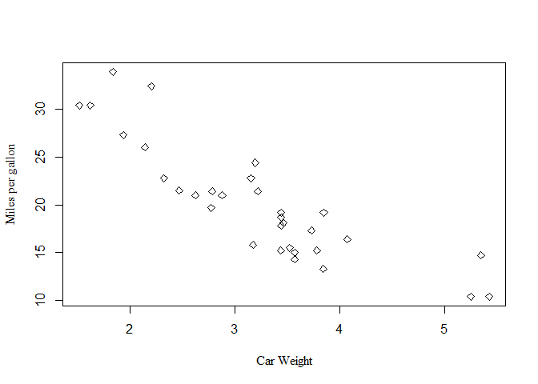
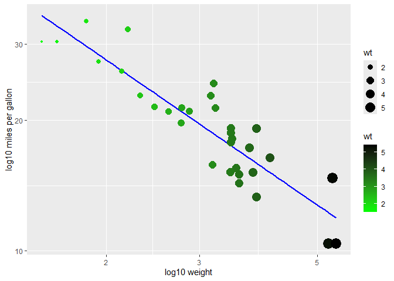
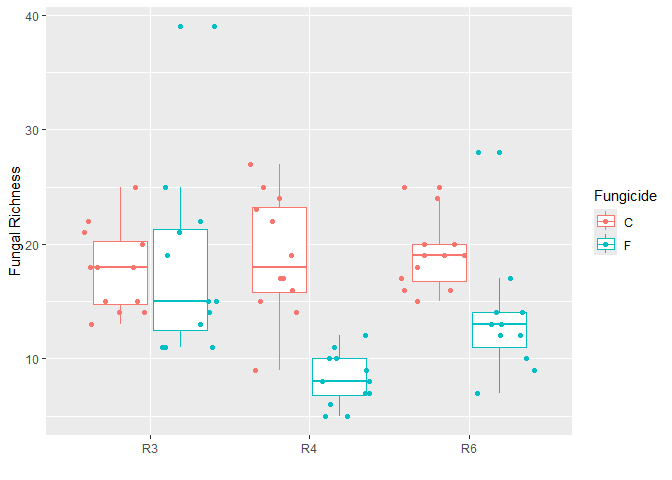
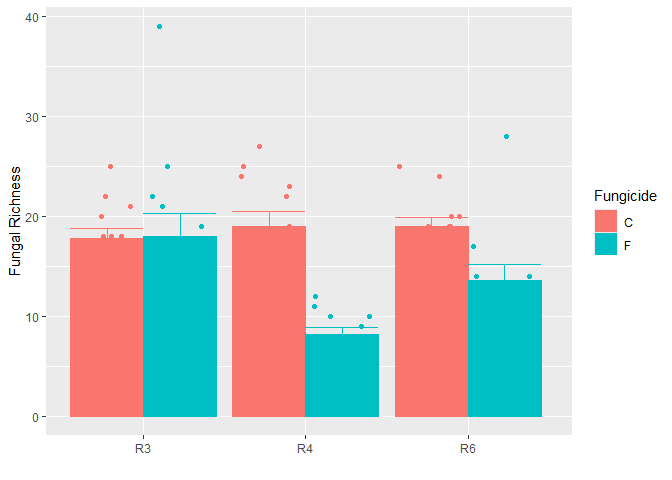
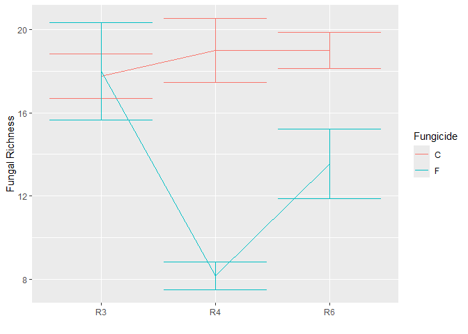
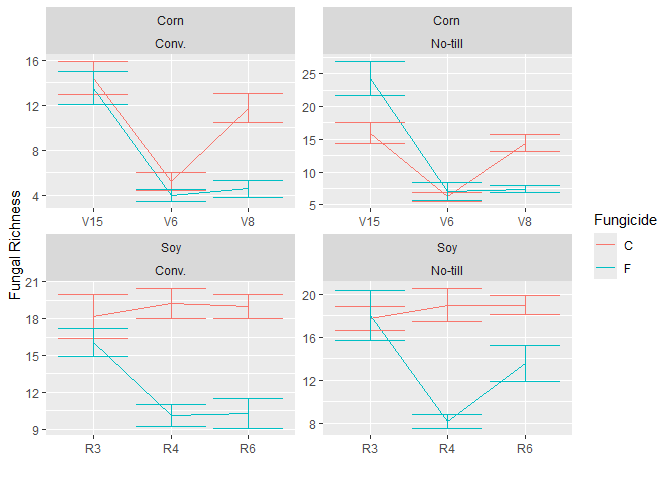

``` r
data("mtcars") #Read inbuilt dataset
str(mtcars) # Look at the structure of the data
```

    ## 'data.frame':    32 obs. of  11 variables:
    ##  $ mpg : num  21 21 22.8 21.4 18.7 18.1 14.3 24.4 22.8 19.2 ...
    ##  $ cyl : num  6 6 4 6 8 6 8 4 4 6 ...
    ##  $ disp: num  160 160 108 258 360 ...
    ##  $ hp  : num  110 110 93 110 175 105 245 62 95 123 ...
    ##  $ drat: num  3.9 3.9 3.85 3.08 3.15 2.76 3.21 3.69 3.92 3.92 ...
    ##  $ wt  : num  2.62 2.88 2.32 3.21 3.44 ...
    ##  $ qsec: num  16.5 17 18.6 19.4 17 ...
    ##  $ vs  : num  0 0 1 1 0 1 0 1 1 1 ...
    ##  $ am  : num  1 1 1 0 0 0 0 0 0 0 ...
    ##  $ gear: num  4 4 4 3 3 3 3 4 4 4 ...
    ##  $ carb: num  4 4 1 1 2 1 4 2 2 4 ...

``` r
#### plot using base R function
plot(mtcars$wt,mtcars$mpg,
     xlab="Car Weight", # add X label
     ylab="Miles per gallon",# add Y label
     font.lab=6,#change font
     pch=23 #Choose the shape for the data points in plot
     )
```

<!-- -->

``` r
#####GGPLOT2####
library(ggplot2)
ggplot(mtcars,aes(x=wt, y=mpg))+ #size=wt))+#### using ggplot, it takes data,(x and y), and then we add layers. size function scales the point size by weight(but it does so for all the layers, and hence can give warnings)
    geom_smooth(method=lm,se=FALSE,color="blue")+ #add a smooth line, showing linear relationship according to linear model, without the confidence intervals, change colour to blue. We can also switch layers by switching which geom comes first.
  geom_point(aes(size=wt,color=wt))+ #adding layer where we show our data points, and put colour of points to red, and scale the points by weight(we can do it by any other variable as well). Colour outside te aesthetic parameters implies the colour is applied to all the points. we can do it in aesthetic if we want it to change by the weight(or any other variable.
  xlab("log10 weight")+#add x label
  ylab("log10 miles per gallon")+# add y label
  scale_color_gradient(low="green",high="black")+#scaling by different colours gradient
  scale_x_log10()+
  scale_y_log10()
```

    ## `geom_smooth()` using formula = 'y ~ x'

<!-- -->

``` r
  #scale_y_continuous(labels=scales::percent)# transform proportion into percentage
```

``` r
######ggplot with categorical X and numeric Y variables
bull.richness<-read.csv("https://raw.githubusercontent.com/ArpanPrj/Reproducibility2025/refs/heads/main/Basics_to_R/Bull_richness.csv")
#Subsetting the soybean data under no till condition
bull.richness.soy.no.till<-bull.richness[bull.richness$Crop=="Soy"&
                                           bull.richness$Treatment=="No-till",]
ggplot(bull.richness.soy.no.till,aes(x=GrowthStage,y=richness,colour=Fungicide))+
  geom_boxplot()+
  xlab("")+
  ylab("Fungal Richness")+
  #geom_point(position=position_dodge(width=0.9)) #width determines how far you want the points to dodge the data line
  geom_point(position=position_jitterdodge(dodge.width=0.9))#jitterdodge ensures they are not overlapping and are spread out
```

<!-- -->

``` r
#####barcharts
ggplot(bull.richness.soy.no.till,aes(x=GrowthStage,y=richness,color=Fungicide,fill=Fungicide))+# using color only adds color to the borders not the bars so we can use fill
   #geom_point(position=position_dodge(width=0.9)) #width determines how far you want the points to dodge the data line
   geom_point(position=position_jitterdodge(dodge.width=0.9))+#jitterdodge ensures they are not overlapping and are spread out
stat_summary(fun=mean,geom="bar",position="dodge")+ #plot the data by mean and dodge it
  stat_summary(fun.data=mean_se,geom="errorbar", position="dodge")+
  xlab("")+
  ylab("Fungal Richness")
```

<!-- -->

``` r
######Line plot connecting means (change geom to line and take out dodge)
ggplot(bull.richness.soy.no.till,aes(x=GrowthStage,y=richness,group=Fungicide,color=Fungicide))+# using color only adds color to the borders not the bars so we can use fill, grouping function treats fungicide as grouping variabe and helps draw a line connecting mean of one to other
   #geom_point(position=position_dodge(width=0.9)) #width determines how far you want the points to dodge the data line
   #geom_point(position=position_jitterdodge(dodge.width=0.9))+#jitterdodge ensures they are not overlapping and are spread out
stat_summary(fun=mean,geom="line")+ #plot the data by mean and dodge it
  stat_summary(fun.data=mean_se,geom="errorbar")+
  xlab("")+
  ylab("Fungal Richness")
```

<!-- -->

``` r
#####Faceting
ggplot(bull.richness, aes(x=GrowthStage,y=richness, group=Fungicide, colour=Fungicide))+
  stat_summary(fun=mean,geom="line")+ #plot the data by mean and dodge it
  stat_summary(fun.data=mean_se,geom="errorbar")+
  xlab("")+
  ylab("Fungal Richness")+
  facet_wrap(~Crop*Treatment,scales="free") # facetwrap splits the data, we can use * to split it by multiple variables, scales allows R to chose the scale as per the data. We can change the order of the variables in facet_wrap to change the order of the facets.
```

<!-- -->
