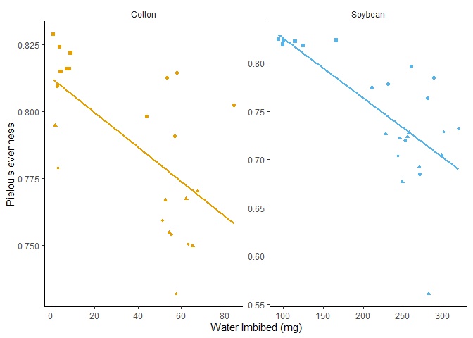

``` r
library(tidyverse)
```

    ## ── Attaching core tidyverse packages ──────────────────────── tidyverse 2.0.0 ──
    ## ✔ dplyr     1.1.4     ✔ readr     2.1.5
    ## ✔ forcats   1.0.0     ✔ stringr   1.5.1
    ## ✔ ggplot2   3.5.1     ✔ tibble    3.2.1
    ## ✔ lubridate 1.9.4     ✔ tidyr     1.3.1
    ## ✔ purrr     1.0.4     
    ## ── Conflicts ────────────────────────────────────────── tidyverse_conflicts() ──
    ## ✖ dplyr::filter() masks stats::filter()
    ## ✖ dplyr::lag()    masks stats::lag()
    ## ℹ Use the conflicted package (<http://conflicted.r-lib.org/>) to force all conflicts to become errors

``` r
library(ggpubr)
library(ggrepel)
library(ggplot2)

#####Using color-blind friendly palette

cbbPalette <- c("#000000", "#E69F00", "#56B4E9", "#009E73", "#F0E442", "#0072B2", "#D55E00", "#CC79A7")

sample.data.bac=read.csv("https://raw.githubusercontent.com/ArpanPrj/Reproducibility2025/refs/heads/main/Data_Visualization_class2/BacterialAlpha.csv", na.strings = "na") #Reading the data
str(sample.data.bac)#View the structure of the dataset
```

    ## 'data.frame':    70 obs. of  10 variables:
    ##  $ Code         : chr  "S01_13" "S02_16" "S03_19" "S04_22" ...
    ##  $ Crop         : chr  "Soil" "Soil" "Soil" "Soil" ...
    ##  $ Time_Point   : int  0 0 0 0 0 0 6 6 6 6 ...
    ##  $ Replicate    : int  1 2 3 4 5 6 1 2 3 4 ...
    ##  $ Water_Imbibed: num  NA NA NA NA NA NA NA NA NA NA ...
    ##  $ shannon      : num  6.62 6.61 6.66 6.66 6.61 ...
    ##  $ invsimpson   : num  211 207 213 205 200 ...
    ##  $ simpson      : num  0.995 0.995 0.995 0.995 0.995 ...
    ##  $ richness     : int  3319 3079 3935 3922 3196 3481 3250 3170 3657 3177 ...
    ##  $ even         : num  0.817 0.823 0.805 0.805 0.819 ...

``` r
sample.data.bac$Time_Point=as.factor(sample.data.bac$Time_Point)# Convert time points to categorical variable
sample.data.bac$Crop=as.factor(sample.data.bac$Crop) # Convert crop type to a categorical variable
```

``` r
sample.data.bac$Crop=factor(sample.data.bac$Crop, levels=c("Soil","Cotton","Soybean"))#Reorder the crop factor into custom order

# plot one -B
bac.even=ggplot(sample.data.bac, aes(x=Time_Point,y=even, color=Crop))+
  geom_boxplot(position=position_dodge())+# Creates boxplots for each time point, grouped by Crop
  geom_point(position=position_jitterdodge(0.05))+# Adds jittered points for better visibility
  xlab("Time")+
  ylab("Pielou's evenness")+
  scale_color_manual(values=cbbPalette)+# Applies custom colors to Crop categories
  theme_classic()# Uses a minimalistic theme
bac.even
```

<!-- -->

``` r
#plot 2-A
sample.data.bac.no.soil=subset(sample.data.bac,Crop!="Soil") # Exclude Soil samples

water.imbibed <- ggplot(sample.data.bac.no.soil, aes(Time_Point, 1000 * Water_Imbibed, color = Crop)) +  # Define aesthetics: x-axis as Time.Point, y-axis as Water_Imbibed (converted to mg), and color by Crop
  geom_jitter(width = 0.5, alpha = 0.5) +  # Add jittered points to show individual data points with some transparency
  stat_summary(fun = mean, geom = "line", aes(group = Crop)) +  # Add lines representing the mean value for each Crop group
  stat_summary(fun.data = mean_se, geom = "errorbar", width = 0.5) +  # Add error bars representing the standard error of the mean
  xlab("Hours post sowing") +  # Label the x-axis
  ylab("Water Imbibed (mg)") +  # Label the y-axis
  scale_color_manual(values = c(cbbPalette[[2]], cbbPalette[[3]]), name = "", labels = c("", "")) +  # Manually set colors for the Crop variable
  theme_classic() +  # Use a classic theme for the plot
  theme(strip.background = element_blank(), legend.position = "none") +  # Customize theme: remove strip background and position legend to the right
  facet_wrap(~Crop, scales = "free")  # Create separate panels for each Crop, allowing free scales
water.imbibed
```

<!-- -->

``` r
#Plot 3-C

water.imbibed.cor <- ggplot(sample.data.bac.no.soil, aes(y = even, x = 1000 * Water_Imbibed, color = Crop)) +  # Define aesthetics: y-axis as even, x-axis as Water_Imbibed (converted to mg), and color by Crop
  geom_point(aes(shape = Time_Point)) +  # Add points with different shapes based on Time.Point
  geom_smooth(se = FALSE, method = lm) +  # Add a linear model smooth line without confidence interval shading
  xlab("Water Imbibed (mg)") +  # Label the x-axis
  ylab("Pielou's evenness") +  # Label the y-axis
  scale_color_manual(values = c(cbbPalette[[2]], cbbPalette[[3]]), name = "", labels = c("Cotton", "Soybean")) +  # Manually set colors for the Crop variable
  scale_shape_manual(values = c(15, 16, 17, 18), name = "", labels = c("0 hrs", "6 hrs", "12 hrs", "18 hrs")) +  # Manually set shapes for the Time.Point variable
  theme_classic() +  # Use a classic theme for the plot
  guides(color="none")+#Remove the color legend
  theme(strip.background = element_blank(), legend.position = "none") +
  facet_wrap(~Crop, scales = "free")  # Create separate panels for each Crop, allowing free scales

water.imbibed.cor
```

    ## `geom_smooth()` using formula = 'y ~ x'

<!-- -->

``` r
#### Figure 2; significance levels added with Adobe or powerpoint #### 

# Arrange multiple ggplot objects into a single figure
figure2 <- ggarrange(
  water.imbibed,  # First plot: water.imbibed
  bac.even,  # Second plot: bac.even
  water.imbibed.cor,  # Third plot: water.imbibed.cor
  labels = "auto",  # Automatically label the plots (A, B, C, etc.)
  nrow = 3,  # Arrange the plots in 3 rows
  ncol = 1,  # Arrange the plots in 1 column
  legend = FALSE  # Do not include a legend in the combined figure
)
```

    ## `geom_smooth()` using formula = 'y ~ x'

``` r
figure2
```

<!-- -->

``` r
######Integrating statistics within the plots
#Anova type designs
bac.even+
  stat_compare_means(method="anova")# Adds ANOVA test result to plot
```

<!-- -->

``` r
bac.even+
  geom_pwc(aes(group=Crop),method="t.test",label="p.adj.format")# Pairwise t-tests between Crop groups, labels used to show the pvalue
```

<!-- -->

``` r
bac.even+
  geom_pwc(aes(group=Time_Point),method="t.test",label="{p.adj.format}{p.adj.signif}")# Pairwise t-tests between Time Points, labels used to shw pvalue and significance
```

<!-- -->

``` r
#Displaying correlation data
water.imbibed.cor + 
  stat_cor() # Adds correlation coefficient to the plot
```

    ## `geom_smooth()` using formula = 'y ~ x'

<!-- -->

``` r
#Displaying regression
water.imbibed.cor + 
  stat_regline_equation()# Adds regression equation to the plot
```

    ## `geom_smooth()` using formula = 'y ~ x'

<!-- -->

``` r
#Diaplaying correlation and regression equation at once
water.imbibed.cor + 
  stat_cor(label.y = 0.7) +
  stat_regline_equation()
```

    ## `geom_smooth()` using formula = 'y ~ x'

<!-- -->

``` r
#############################################
#Creation of volcano plot
diff.abund <- read.csv("https://raw.githubusercontent.com/ArpanPrj/Reproducibility2025/refs/heads/main/Data_Visualization_class2/diff_abund.csv")# Load differential abundance data
str(diff.abund)  # Display structure of the dataset
```

    ## 'data.frame':    2375 obs. of  16 variables:
    ##  $ taxon           : chr  "BOTU_1387" "BOTU_1197" "BOTU_2475" "BOTU_1574" ...
    ##  $ lfc_CropCotton  : num  0.016 0.1019 -0.0503 0.1019 0.0791 ...
    ##  $ lfc_CropSoybean : num  -0.305 0.191 -0.0213 0.2592 0.9588 ...
    ##  $ p_CropCotton    : num  0.947 0.572 0.806 0.531 0.846 ...
    ##  $ p_CropSoybean   : num  0.193 0.28 0.915 0.103 0.016 ...
    ##  $ q_CropCotton    : num  1 1 1 1 1 1 1 1 1 1 ...
    ##  $ q_CropSoybean   : num  1 1 1 1 1 ...
    ##  $ diff_CropCotton : logi  FALSE FALSE FALSE FALSE FALSE FALSE ...
    ##  $ diff_CropSoybean: logi  FALSE FALSE FALSE FALSE FALSE FALSE ...
    ##  $ Kingdom         : chr  "Bacteria" "Bacteria" "Bacteria" "Bacteria" ...
    ##  $ Phylum          : chr  "Proteobacteria" "Proteobacteria" "Proteobacteria" "Proteobacteria" ...
    ##  $ Class           : chr  "Gammaproteobacteria" "Gammaproteobacteria" "Gammaproteobacteria" "Gammaproteobacteria" ...
    ##  $ Order           : chr  "Legionellales" "Diplorickettsiales" "Diplorickettsiales" "Diplorickettsiales" ...
    ##  $ Family          : chr  "Legionellaceae" "Diplorickettsiaceae" "Diplorickettsiaceae" "Diplorickettsiaceae" ...
    ##  $ Genus           : chr  "Legionella" "Aquicella" "Aquicella" "unidentified" ...
    ##  $ Label           : chr  "BOTU_1387_Legionella" "BOTU_1197_Aquicella" "BOTU_2475_Aquicella" "BOTU_1574_Diplorickettsiaceae" ...

``` r
diff.abund$log10_pvalue=-log10(diff.abund$p_CropSoybean)# Convert p-values to -log10 scale for better visualization
diff.abund.label=diff.abund[diff.abund$log10_pvalue>30,]# Subset significant features

ggplot()+
  geom_point(data=diff.abund,aes(x=lfc_CropSoybean,y=log10_pvalue,color=diff_CropSoybean))+# Add scatter points for each feature, colored by significance status
  theme_classic()+# Apply a clean, minimalistic theme for better visualization
  geom_text_repel(data=diff.abund.label,aes(x=lfc_CropSoybean,y=log10_pvalue,color=diff_CropSoybean,label=Label))+# Add text labels for only the most significant points
  # Uses geom_text_repel() to prevent overlapping labels
  scale_color_manual(values = cbbPalette, name="Significant")+ # Manually set colors for significance groups using a predefined color palette
  xlab("Log fold change soil vs soybean")+
  ylab("-log10 pvalue")
```

<!-- -->

``` r
######Improving visualization
ggplot()+
  geom_point(data=diff.abund,aes(x=lfc_CropSoybean,y=log10_pvalue,color=diff_CropSoybean))+
  geom_point(data=diff.abund.label,aes(x=lfc_CropSoybean,y=log10_pvalue,color=diff_CropSoybean),shape=17, color="red",size=4)+#Changing the shape, size and color of the points to visualize better
  theme_classic()+
  geom_text_repel(data=diff.abund.label,aes(x=lfc_CropSoybean,y=log10_pvalue,color=diff_CropSoybean,label=Label),color="red")+ #Changing the colour of text to red
  scale_color_manual(values = cbbPalette, name="Significant")+
  xlab("Log fold change soil vs soybean")+
  ylab("-log10 pvalue")
```

<!-- -->
