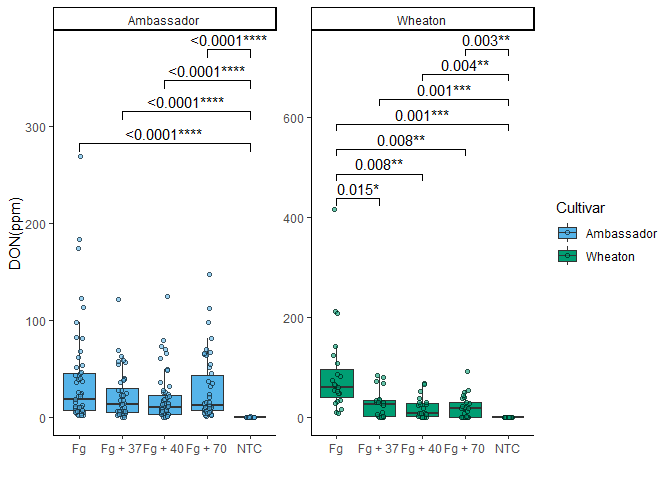

# Question 1

Explain the following

1.  YAML header A YAML header is an important cpmponent at the beginning
    of an R Markdown document. It is enclosed between triple dashes (—)
    and uses YAML syntax to define various parameters and configuration
    options. This header serves multiple purposes, including specifying
    document metadata (such as title, author, and date), setting the
    output format (e.g., HTML, PDF, or Word), customizing document
    appearance (themes, table of contents), defining parameters for use
    throughout the document, and specifying bibliography details.

2.  Literate programming Literate programming is a way of writing code
    that focuses on making it easy for people to understand. It combines
    natural language with code snippets to explain how programs work.
    This approach helps create clear documentation and makes it easier
    for programmers to grasp the logic behind the code. It also allows
    for two types of output: one for computers to run and another for
    humans to read. This method has inspired tools such as R Markdown,
    which are widely used in science and data analysis.

# Question 2

Take the code you wrote for coding challenge 3, question 5, and
incorporate it into your R markdown file. Some of you have already been
doing this, which is great! Your final R markdown file should have the
following elements.

1.  At the top of the document, make a clickable link to the manuscript
    where these data are published. The link is here:

Noel, Z.A., Roze, L.V., Breunig, M., Trail, F. 2022. Endophytic fungi as
promising biocontrol agent to protect wheat from Fusarium graminearum
head blight. Plant Disease. <https://doi.org/10.1094/PDIS-06-21-1253-RE>

2.  Read the data using a relative file path with na.strings option set
    to “na”. This means you need to put the Mycotoxin.csv file we have
    used for the past two weeks into your directory, which git tracks.

3.  Make a separate code chunk for the figures plotting the DON data,
    15ADON, and Seedmass, and one for the three combined using
    ggarrange.

[**Manuscript link**:
https://doi.org/10.1094/PDIS-06-21-1253-RE](https://doi.org/10.1094/PDIS-06-21-1253-RE)

``` r
library(ggplot2)
library(ggpubr)
#Reading the data and converting "na" strings to NA values
datum=read.csv("Data_Visualization_class1/MycotoxinData.csv",na.strings="na")

# Convert categorical variables to factors
datum$Treatment=as.factor(datum$Treatment)  # Convert treatment column to a categorical variable
datum$Cultivar=as.factor(datum$Cultivar)# Convert cultivar column to a categorical variable
datum$BioRep=as.factor(datum$BioRep) # Convert biological replicate column to a categorical variable

#Using colour blind palette
cbbPalette <- c( "#E69F00", "#56B4E9", "#009E73", "#F0E442", "#0072B2", "#D55E00", "#CC79A7","#000000")
```

## DON

``` r
plot1<-ggplot(datum, aes(Treatment,DON,fill=Cultivar))+
  geom_boxplot(outlier.shape = NA)+ #adding boxplot in figure but removing outliers(the black dots that popped up)
  geom_point(position=position_jitterdodge(dodge.width=0.9),shape=21,alpha=0.6)+#Adding jitter points over the boxplot
  scale_fill_manual(values = cbbPalette[c(2, 3)])+#filling the points and boxplots Cultivar with two colors from the cbbPallete 
  xlab("")+#Changing x label
  ylab("DON(ppm)")+#Changing y label
  facet_wrap(~Cultivar,scales="free")+#faceting by cultivar
  theme_classic() + #Using classic theme
  geom_pwc(aes(group=Treatment),method="t.test",label="{p.adj.format}{p.adj.signif}",hide.ns=T)#Using geom_pwc to do pairwise comparison and hiding non significant p values.
plot1
```

    ## Warning: Removed 8 rows containing non-finite outside the scale range
    ## (`stat_boxplot()`).

    ## Warning: Removed 8 rows containing non-finite outside the scale range
    ## (`stat_pwc()`).

    ## Warning: Removed 8 rows containing missing values or values outside the scale range
    ## (`geom_point()`).

<!-- -->

## 15ADON

``` r
# Change the y-variable to plot X15ADON and MassperSeed_mg. The y-axis label should now be “15ADON” and “Seed Mass (mg)”. Save plots made in questions 1 and 3 into three separate R objects. 
 plot2<-ggplot(datum, aes(Treatment,X15ADON,fill=Cultivar))+#Changing y variable to X15DON
   geom_boxplot(outlier.shape = NA)+
   geom_point(position=position_jitterdodge(dodge.width=0.9),shape=21,alpha=0.6)+
   scale_fill_manual(values = cbbPalette[c(2, 3)])+
   xlab("")+
   ylab("15ADON")+#Changing the label as per y variable used
   facet_wrap(~Cultivar,scales="free")+
   theme_classic()+
   geom_pwc(aes(group=Treatment),method="t.test",label="{p.adj.format}{p.adj.signif}",hide.ns=T)
plot2
```

    ## Warning: Removed 10 rows containing non-finite outside the scale range
    ## (`stat_boxplot()`).

    ## Warning: Removed 10 rows containing non-finite outside the scale range
    ## (`stat_pwc()`).

    ## Warning: Removed 10 rows containing missing values or values outside the scale range
    ## (`geom_point()`).

<!-- -->

## Seed mass

``` r
plot3<-ggplot(datum, aes(Treatment,MassperSeed_mg,fill=Cultivar))+#Changing y variable to MassperSpeed_mg
   geom_boxplot(outlier.shape = NA)+
   geom_point(position=position_jitterdodge(dodge.width=0.9),shape=21,alpha=0.6)+
   scale_fill_manual(values = cbbPalette[c(2, 3)])+
   xlab("")+
   ylab("Seed Mass (mg)")+#Changing y label as per y variable used
   facet_wrap(~Cultivar,scales="free")+
   theme_classic()+
   geom_pwc(aes(group=Treatment),method="t.test",label="{p.adj.format}{p.adj.signif}",hide.ns=T)
plot3
```

    ## Warning: Removed 2 rows containing non-finite outside the scale range
    ## (`stat_boxplot()`).

    ## Warning: Removed 2 rows containing non-finite outside the scale range
    ## (`stat_pwc()`).

    ## Warning: Removed 2 rows containing missing values or values outside the scale range
    ## (`geom_point()`).

<!-- -->

## Combined

``` r
# combining all three figures into one with three columns and one row.
figure <- ggarrange(plot1,plot2,plot3,labels = c("A","B","C"),nrow = 1,ncol = 3, common.legend = T)
```

    ## Warning: Removed 8 rows containing non-finite outside the scale range
    ## (`stat_boxplot()`).

    ## Warning: Removed 8 rows containing non-finite outside the scale range
    ## (`stat_pwc()`).

    ## Warning: Removed 8 rows containing missing values or values outside the scale range
    ## (`geom_point()`).

    ## Warning: Removed 8 rows containing non-finite outside the scale range
    ## (`stat_boxplot()`).

    ## Warning: Removed 8 rows containing non-finite outside the scale range
    ## (`stat_pwc()`).

    ## Warning: Removed 8 rows containing missing values or values outside the scale range
    ## (`geom_point()`).

    ## Warning: Removed 10 rows containing non-finite outside the scale range
    ## (`stat_boxplot()`).

    ## Warning: Removed 10 rows containing non-finite outside the scale range
    ## (`stat_pwc()`).

    ## Warning: Removed 10 rows containing missing values or values outside the scale range
    ## (`geom_point()`).

    ## Warning: Removed 2 rows containing non-finite outside the scale range
    ## (`stat_boxplot()`).

    ## Warning: Removed 2 rows containing non-finite outside the scale range
    ## (`stat_pwc()`).

    ## Warning: Removed 2 rows containing missing values or values outside the scale range
    ## (`geom_point()`).

``` r
figure
```

<!-- -->

# Question 3

Knit your document together in the following formats: a. .docx (word
document) OR .pdf with a table of contents [Link for my pdf
file](%22R_markdown/Coding_Challenge_4/Coding_Challenge_4.pdf%22) b.
GitHub flavored markdown (.md file). [Link for my md
file](%22R_markdown/Coding_Challenge_4/Coding_Challenge_4.md%22)

# Question 4

Push the .docx or .pdf and .md files to GitHub inside a directory called
Coding Challenge 4.

DONE

# Question 5

Now edit, commit, and push the README file for your repository and
include the following elements.

1.  A clickable link in your README to your GitHub flavored .md file

2.  A file tree of your GitHub repository.

DONE

# Question 6

Please provide me a clickable link to your GitHub

[Link to my
Github](%22https://github.com/ArpanPrj/Reproducibility2025.git%22)
